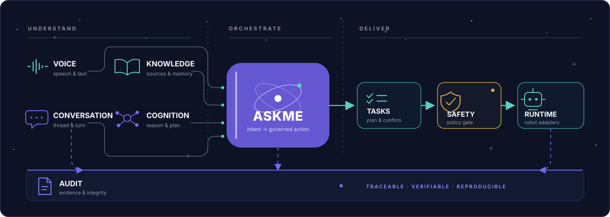

<div align="center">


# AskMe

**让机器人把“听懂”变成安全、可审计、可交付的现场行动。**

面向机器人方案商与系统集成商的现场运营交付中台：连接语音、知识、任务、安全运行时与验收证据。

[](https://github.com/Kitjesen/askme/actions/workflows/ci.yml)
[](pyproject.toml)
[](pyproject.toml)
[](LICENSE)
[](docs/API.md)
[](docker/README.md)
[](https://github.com/Kitjesen/askme/stargazers)

[English](README.en.md) · [产品](docs/PRODUCT.md) · [架构](docs/ARCHITECTURE.md) · [API](docs/API.md) · [部署](docs/DEPLOYMENT.md)

</div>

> [!IMPORTANT]
> AskMe 负责理解、编排、交付与审计，不替代底盘控制器。真实动作必须经过 `TaskHandoff`、`SafetyPreflight` 和 Runtime Arbiter；客户签收也不等于生产就绪。

## ✨ 核心能力

<table>
  <tr>
    <td width="33%" valign="top"><br /><strong>语音与对话</strong><br />ASR → LLM → TTS、打断与文本兜底；Realtime S2S 是可选链路，默认关闭。</td>
    <td width="33%" valign="top"><br /><strong>知识与记忆</strong><br />客户知识上传、审批、检索证据与过期治理；行为记忆与客户知识保持隔离。</td>
    <td width="33%" valign="top"><br /><strong>认知与技能</strong><br />意图理解、规划、能力目录与受控 MCP 工具；模型不拥有硬件执行权。</td>
  </tr>
  <tr>
    <td width="33%" valign="top"><br /><strong>安全门禁</strong><br />任务确认、风险预检、权限边界、暂停与急停先于真实执行。</td>
    <td width="33%" valign="top"><br /><strong>现场运行时</strong><br />语音、感知、现场事件、运行交接与机器人适配，面向 Demo-to-pilot 交付。</td>
    <td width="33%" valign="top"><br /><strong>审计与证据</strong><br />Thread / Turn / Generation 账本、统一审计时间线与可导出的验收证据。</td>
  </tr>
</table>

## 🚀 快速开始

要求：Python 3.11+。启动具体运行时前，请按[部署指南](docs/DEPLOYMENT.md)配置模型、密钥和硬件资源。

```powershell
python -m pip install -e ".[dev]"
askme runtime blueprints --customer-visible
```

第二条命令会列出当前客户可见蓝图及 readiness。选择一个入口：

```powershell
python -m askme.blueprints.presets.text        # 文本开发运行时
python -m askme.blueprints.presets.voice       # 语音任务中心
python -m askme.blueprints.presets.edge_robot  # 园区巡检机器人
python -m askme.mcp.server                     # 受控 MCP 服务
```

Dashboard：

```powershell
python scripts/dev/run_dashboard_only.py --host 127.0.0.1 --port 8766
```

打开 <http://127.0.0.1:8766/dashboard>。Docker 与 Linux edge 部署见 [docker/README.md](docker/README.md)。

## 🌌 项目星象图

<p align="center">
  
</p>

AskMe 是可组合的对话与交付核心。长期业务对话不会绑定某一个云端连接：

```text
Person → Interaction Gate → Voice / Text → Conversation
       → Knowledge + Cognition → Tasks → Safety → Runtime → Audit Evidence

Thread → Turn → Generation → replaceable Provider Session
```

## 🏗️ 架构原则

- **意图与执行分离**：LLM 负责理解和规划，Runtime / Safety / Hardware 拥有真实执行权。
- **证据优先**：知识回答、现场事件、任务结果和客户验收都保留来源与审计关系。
- **故障关闭**：缺少凭据、硬件、审批或 readiness 时明确拒绝，不伪报 ready。
- **连接可替换**：供应商会话可以重建，Conversation Thread 和已提交 Turn 保持稳定。

```text
askme/
├─ blueprints/        # 产品组合根：text / voice / edge_robot / site adapters
├─ voice/             # ASR、TTS、Realtime S2S、播放与音频诊断
├─ conversation/      # Thread / Turn / Generation 事实账本
├─ pipeline/          # BrainPipeline、VoiceLoop 与现场链路
├─ cognition/         # 意图、规划与任务理解
├─ memory/            # 客户知识与机器人行为记忆
├─ skills/ · tools/ · mcp/  # 能力准入与受控工具表面
├─ runtime/ robot/    # 生命周期、安全交接与硬件执行边界
├─ audit/             # 审计、完整性与证据导出
└─ api/ static/       # FastAPI 表面与 Dashboard
```

详见[高级软件架构蓝图](docs/SOFTWARE_ARCHITECTURE_BLUEPRINT.md)与 [Conversation Core 领域语言](CONTEXT.md)。

## 🧭 运行入口

| 入口 | 用途 | 状态口径 |
| --- | --- | --- |
| `text` | 研发、CI、无音频环境调试 | 内部运行时 |
| `voice` | 语音问答、任务确认、客户演示 | Demo / lab 验证 |
| `voice_perception` | 语音 + 感知 freshness + 交互准入 | 需现场配置 |
| `edge_robot` | 园区/厂区试点、事件与控制适配 | Pilot，需硬件验收 |
| `lingtu_voice` | 灵途导航项目适配 | Site-specific |

实时语音供应商、全双工声学门禁和公网验收口径见[实时语音文档](docs/REALTIME_VOICE_PROVIDERS.md)。

## ✅ 验证

```powershell
python -m pytest tests -q
python -m pytest tests -m "slow" -q
ruff check askme tests
python -m mypy askme/ --ignore-missing-imports --no-error-summary  # 非阻断类型检查
```

边界敏感变更还应运行：

```powershell
python -m pytest tests/test_six_layer_package_boundaries.py tests/test_package_migration_compat.py -q
```

## 📚 文档导航

| 文档 | 内容 |
| --- | --- |
| [产品手册](docs/PRODUCT.md) | 产品能力、边界与路线图 |
| [产品需求](docs/PRODUCT_REQUIREMENTS.md) | P0 与 R1–R7 需求主干 |
| [架构说明](docs/ARCHITECTURE.md) | 模块职责与依赖方向 |
| [API](docs/API.md) | HTTP API 参考 |
| [部署](docs/DEPLOYMENT.md) | 环境、凭据、Docker 与运维 |
| [实时语音](docs/REALTIME_VOICE_PROVIDERS.md) | Qwen、豆包 S2S 与验收口径 |
| [运维手册](docs/OPERATIONS.md) | 健康检查、交付和故障处理 |
| [贡献指南](CONTRIBUTING.md) | 开发流程与协作约定 |
| [安全策略](SECURITY.md) | 漏洞报告与安全边界 |

<details>
<summary><strong>项目交付边界</strong></summary>

可以承诺：受控场景下的语音问路、知识问答、巡检任务、现场事件、能力中心和审计闭环。

没有现场证据前不承诺：无人值守生产运行、任意开放域问答、大模型直接控制硬件，或未接真实传感器/通知/控制网关时的处置效果。

</details>

## 🤝 参与项目

提交变更前请阅读 [CONTRIBUTING.md](CONTRIBUTING.md)。AskMe 使用 [MIT License](LICENSE)。
