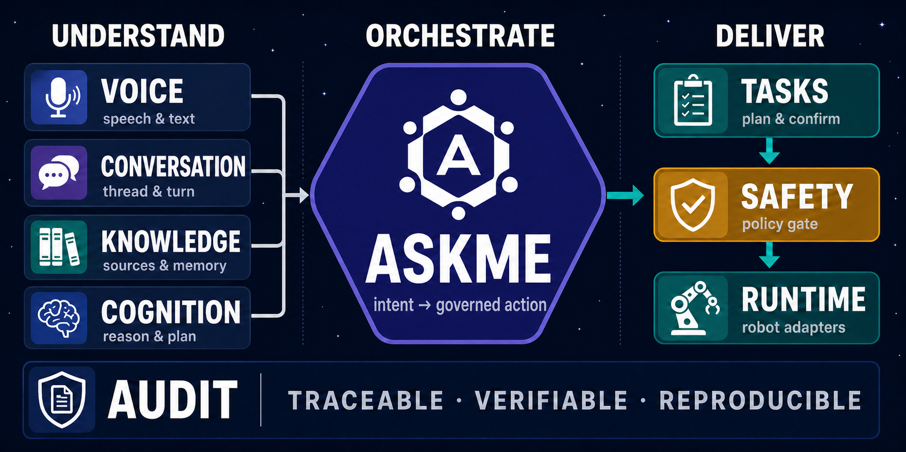

<div align="center">


# AskMe

**Voice-driven robot runtime, governed by safety and evidence.**

让机器人从“听懂”走向安全、可审计、可交付的现场行动。

[](https://github.com/Kitjesen/askme/actions/workflows/ci.yml)
[](pyproject.toml)
[](pyproject.toml)
[](LICENSE)

[快速开始](#快速开始) · [系统架构](#系统架构) · [运行入口](#运行入口) · [文档](#文档) · [English](README.en.md)

</div>

<p align="center">
  
</p>

<p align="center">
  <code>VOICE FIRST</code>&nbsp;&nbsp; <code>SAFETY GOVERNED</code>&nbsp;&nbsp; <code>AUDIT READY</code>&nbsp;&nbsp; <code>PROVIDER AGNOSTIC</code>
</p>

## 一个运行时，三项职责

<table>
  <tr>
    <td width="33%" valign="top">
      <br /><br />
      <sub><strong>01 / UNDERSTAND</strong></sub><br />
      <strong>理解语音、上下文与客户知识</strong><br />
      <sub>Voice · Conversation · Knowledge</sub>
    </td>
    <td width="33%" valign="top">
      <br /><br />
      <sub><strong>02 / GOVERN</strong></sub><br />
      <strong>让真实动作通过确认与安全仲裁</strong><br />
      <sub>Tasks · Safety · Runtime</sub>
    </td>
    <td width="33%" valign="top">
      <br /><br />
      <sub><strong>03 / PROVE</strong></sub><br />
      <strong>为任务、现场事件与验收保留证据</strong><br />
      <sub>Audit · Delivery Evidence</sub>
    </td>
  </tr>
</table>

## 快速开始

要求 Python 3.11+。运行具体蓝图前，请按[部署指南](docs/DEPLOYMENT.md)配置模型、密钥和硬件资源。

```powershell
python -m pip install -e ".[dev]"
askme runtime blueprints --customer-visible
```

从文本开发运行时开始：

```powershell
python -m askme.blueprints.presets.text
```

<details>
<summary><strong>Dashboard、Docker 与其他启动方式</strong></summary>

```powershell
python -m askme.blueprints.presets.voice       # 语音任务中心
python -m askme.blueprints.presets.edge_robot  # 园区巡检机器人
python -m askme.mcp.server                     # 受控 MCP 服务
python scripts/dev/run_dashboard_only.py --host 127.0.0.1 --port 8766
```

Dashboard 地址：<http://127.0.0.1:8766/dashboard>。Docker 与 Linux edge 部署见 [docker/README.md](docker/README.md)。

</details>

## 系统架构

AskMe 将长期业务事实与短生命周期的供应商连接分开：对话可以持续，Provider Session 可以安全重建。

```text
Person → Interaction Gate → Voice / Text → Conversation
       → Knowledge + Cognition → Tasks → Safety → Runtime → Audit Evidence

Thread → Turn → Generation → replaceable Provider Session
```

> [!IMPORTANT]
> AskMe 负责理解、编排、交付与审计，不替代底盘控制器。真实动作必须经过 `TaskHandoff`、`SafetyPreflight` 和 Runtime Arbiter；客户签收也不等于生产就绪。

| 原则 | 约束 |
| --- | --- |
| **Intent ≠ Execution** | 模型理解和规划；Runtime、Safety 与 Hardware 拥有真实执行权。 |
| **Evidence first** | 知识回答、现场事件、任务结果和客户验收保留来源关系。 |
| **Fail closed** | 缺少凭据、硬件、审批或 readiness 时明确拒绝，不伪报 ready。 |
| **Replaceable sessions** | 供应商会话可重建，Conversation Thread 与已提交 Turn 保持稳定。 |

## 运行入口

| 入口 | 用途 | 状态口径 |
| --- | --- | --- |
| `text` | 研发、CI、无音频环境调试 | 内部运行时 |
| `voice` | 语音问答、任务确认、客户演示 | Demo / lab 验证 |
| `voice_perception` | 语音、感知 freshness 与交互准入 | 需现场配置 |
| `edge_robot` | 园区/厂区试点、事件与控制适配 | Pilot，需硬件验收 |
| `lingtu_voice` | 灵途导航项目适配 | Site-specific |

实时语音供应商、全双工声学门禁和公网验收口径见[实时语音文档](docs/REALTIME_VOICE_PROVIDERS.md)。

## 开发与验证

```powershell
python -m pytest tests -q
ruff check askme tests
python -m mypy askme/ --ignore-missing-imports --no-error-summary  # 非阻断类型检查
```

<details>
<summary><strong>项目结构与边界测试</strong></summary>

```text
askme/
├─ blueprints/              # 产品组合根
├─ voice/                   # ASR、TTS、Realtime S2S 与音频诊断
├─ conversation/            # Thread / Turn / Generation 事实账本
├─ pipeline/                # BrainPipeline、VoiceLoop 与现场链路
├─ cognition/               # 意图、规划与任务理解
├─ memory/                  # 客户知识与行为记忆
├─ skills/ · tools/ · mcp/  # 能力准入与受控工具表面
├─ runtime/ · robot/        # 生命周期、安全交接与硬件执行边界
├─ audit/                   # 审计、完整性与证据导出
└─ api/ · static/           # FastAPI 表面与 Dashboard
```

```powershell
python -m pytest tests/test_six_layer_package_boundaries.py tests/test_package_migration_compat.py -q
```

</details>

## 文档

| 从这里开始 | 内容 |
| --- | --- |
| [产品手册](docs/PRODUCT.md) | 产品能力、边界与路线图 |
| [架构说明](docs/ARCHITECTURE.md) | 模块职责与依赖方向 |
| [API](docs/API.md) | HTTP API 参考 |
| [部署](docs/DEPLOYMENT.md) | 环境、凭据、Docker 与运维 |
| [实时语音](docs/REALTIME_VOICE_PROVIDERS.md) | Qwen、豆包 S2S 与验收口径 |
| [运维手册](docs/OPERATIONS.md) | 健康检查、交付和故障处理 |
| [贡献指南](CONTRIBUTING.md) | 开发流程与协作约定 |

<details>
<summary><strong>交付边界</strong></summary>

可以承诺：受控场景下的语音问路、知识问答、巡检任务、现场事件、能力中心和审计闭环。

没有现场证据前不承诺：无人值守生产运行、任意开放域问答、大模型直接控制硬件，或未接真实传感器、通知与控制网关时的处置效果。

</details>

## 参与项目

提交变更前请阅读 [CONTRIBUTING.md](CONTRIBUTING.md)。AskMe 使用 [MIT License](LICENSE)。
