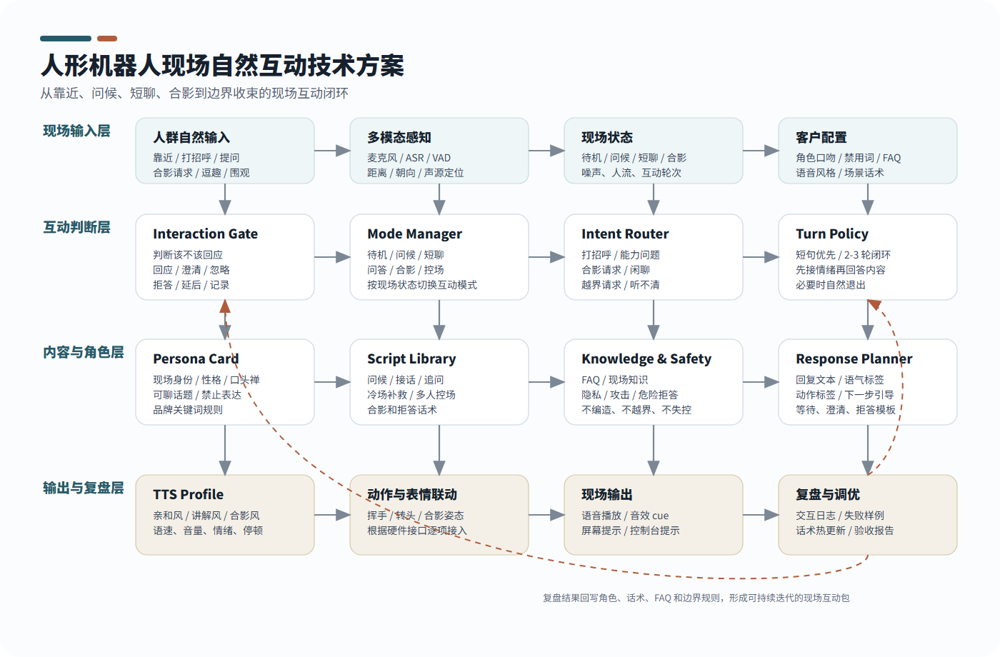

# AskMe 人形机器人现场自然互动语音包方案

## 0. 客户版摘要

本方案面向人形机器人在真实现场“站在那里和人互动”的场景。它不是舞台主持型方案，也不是问路接待方案，而是让机器人在有人靠近、打招呼、提问、逗它、围观、合影、多人同时说话或临时冷场时，都能自然、连续、稳定、有边界地回应。

客户要的核心效果可以用一句话概括：

> 机器人放在现场，人走过去愿意和它说话；说了以后它能接住、能继续、能收住，不尴尬、不乱答、不冷场。

因此，这个“语音包”不只是音色，而是一套 **现场自然互动体验包**。它包含：

- 机器人现场人设
- 语音风格和情绪参数
- 自然开场话术
- 多轮短对话策略
- 观众提问和闲聊承接
- 合影与围观互动
- 多人说话和噪声处理
- 冷场补救
- 礼貌拒答和安全边界
- 可彩排、可验收、可复盘的标准脚本

商演、展出、门店、展厅、品牌活动都可以使用这套能力，但它的主线不是“主持”，而是 **机器人与人自然交流**。

## 1. 方案定位

人形机器人与普通语音助手最大的区别在于：人会把它当成一个“在场的对象”。现场观众不会只关心它能不能回答问题，而会关心它是否像一个可以互动的角色：

- 我走近它，它有没有反应？
- 我说“你好”，它会不会自然回应？
- 我随口问一句，它会不会答非所问？
- 我开玩笑，它能不能接住但不失控？
- 好几个人一起说话，它会不会乱答？
- 我想合影，它能不能配合？
- 它听不清时会不会尴尬沉默？
- 它会不会说出不该说的话？

本方案解决的就是这一层现场体验。目标不是让机器人“说更多”，而是让机器人在合适的时候说合适的话。

### 1.1 与舞台主持型方案的区别

| 舞台主持型方案 | 现场自然互动方案 |
| --- | --- |
| 以舞台流程为中心 | 以人与机器人自然交流为中心 |
| 强调开场、串场、主持人 cue | 强调靠近、问候、闲聊、问答、围观、合影 |
| 适合固定节目 | 适合长时间放在现场被人不断体验 |
| 机器人像主持嘉宾 | 机器人像一个会接话的现场伙伴 |
| 脚本优先 | 状态、意图和短轮次互动优先 |
| 可作为子场景 | 是本方案主线 |

商演仍然可以覆盖，但只是应用场景之一，不是首版产品包的主方向。

### 1.2 交付目标

首版建议把目标定为：

1. **自然进入互动**
   人靠近、招手、打招呼或看向机器人时，机器人能自然开启互动。

2. **流畅承接短对话**
   面对普通问题、轻松闲聊、现场玩笑，机器人能接住 2-3 轮，不一问一答就断。

3. **现场不尴尬**
   听不清、多人说话、观众冷场、问题太长时，机器人有自然补救话术。

4. **有边界地互动**
   面对隐私、攻击、危险、竞品攻击、敏感问题，机器人能礼貌收住。

5. **可配置可复盘**
   客户可以配置角色、语气、禁用词、FAQ 和互动场景，并通过日志复盘。

## 2. 典型现场

### 2.1 展厅和展会现场

机器人站在展区入口、产品旁边或互动区，观众会不断靠近、试探、提问、拍照。

典型输入：

- “你好。”
- “你会什么？”
- “你是真的机器人吗？”
- “你能介绍一下这里吗？”
- “能合影吗？”
- “你听得懂我说话吗？”

机器人目标：

- 快速打开互动
- 不像说明书朗读
- 把问题自然导向现场内容
- 让观众愿意继续问下一句

### 2.2 门店和品牌活动现场

机器人作为门店互动装置、品牌互动伙伴或活动亮点存在。

典型输入：

- “你今天在这里干嘛？”
- “你有什么推荐？”
- “你能陪我聊两句吗？”
- “我可以拍你吗？”
- “你能不能说一句祝福？”

机器人目标：

- 亲和、轻松、有品牌感
- 能短句介绍活动或品牌
- 能配合拍照和传播
- 不强行推销，不让人有压力

### 2.3 围观和合影现场

多人围在机器人旁边，小朋友、家长、客户、媒体同时互动。

典型输入：

- 多人同时说“看这里”
- “挥个手。”
- “我们拍一张。”
- “你说一句好玩的。”
- “小朋友问你一个问题。”

机器人目标：

- 先稳住现场秩序
- 用短句回应
- 提示站位和倒计时
- 不被多人输入带乱

### 2.4 轻角色互动现场

客户希望机器人有一点人设，但不一定是完整 IP。

典型输入：

- “你是谁？”
- “你从哪里来？”
- “你像不像人？”
- “你会不会累？”
- “你喜欢人类吗？”

机器人目标：

- 有角色感
- 不过度表演
- 既好玩又可信
- 能自然回到真实能力边界

### 2.5 商演和发布会现场

商演不是主线，但可以作为增强场景。机器人可以进行短开场、配合主持人、参与问答或合影。

机器人目标：

- 可以完成短流程
- 但不把整个方案定义成主持系统
- 重点仍是人群互动的自然度和可控性

## 3. 核心能力

### 3.1 会进入

机器人不能一直沉默，也不能乱插话。它需要判断什么时候适合进入互动。

进入方式：

- 人靠近
- 人看向机器人
- 人招手
- 人说“你好”
- 人问“你会什么”
- 控制台触发
- 现场工作人员触发

进入话术示例：

> 你好，我在。你可以和我打个招呼，也可以问我一个问题。

### 3.2 会接话

机器人要先回应人的表达，再回答内容。

示例：

用户：

> 你是真的机器人吗？

机器人：

> 是的，我是真的站在你面前的机器人。不过我最重要的能力不是站着，而是能和你现场对话。

### 3.3 会追问

用户说得太模糊时，不要乱猜，要自然追问。

示例：

用户：

> 你给我介绍一下。

机器人：

> 可以。你想听我介绍自己，还是介绍这个现场？

### 3.4 会转场

一段对话结束后，要给用户下一步，而不是突然停住。

示例：

> 这个问题我回答完了。你还可以问我一个关于机器人的问题，或者和我合影。

### 3.5 会控场

多人说话、现场嘈杂、用户起哄时，机器人要能稳住。

示例：

> 现场有点热闹。我先回答正前方这位朋友的问题，其他问题我们一个一个来。

### 3.6 会退出

用户没有继续互动时，机器人要自然退出，不一直追问。

示例：

> 那我先在这里待命。你想继续互动时，直接叫我就可以。

## 4. 互动模式

### 4.1 待机感知模式

用途：机器人站在现场时的默认状态。

机器人行为：

- 保持安静
- 观察是否有人靠近
- 根据配置决定是否主动问候
- 不频繁打扰路人

验收标准：

- 不在人群路过时频繁插话
- 有人明确靠近或打招呼时能启动互动

### 4.2 自然问候模式

用途：建立第一句话。

机器人行为：

- 短句回应
- 给用户一个简单选择
- 不问隐私信息

话术示例：

> 你好，我在。你想和我聊两句，还是想让我介绍一下自己？

### 4.3 自由短聊模式

用途：处理观众随口交流。

机器人行为：

- 支持 2-3 轮短对话
- 语气轻松
- 不展开过长回答
- 适时把话题收回

话术示例：

> 这个问题挺有意思。我用一句话回答：我更像一个现场互动伙伴，不是手机里的语音助手。

### 4.4 现场问答模式

用途：回答“你是谁”“你会什么”“这里是什么”等问题。

机器人行为：

- 回答简洁
- 可结合客户现场 FAQ
- 不知道时不编造

话术示例：

> 我可以回答现场相关问题，也可以和你进行简短互动。如果是特别具体的信息，我会建议你问现场工作人员。

### 4.5 合影互动模式

用途：支持传播和拍照。

机器人行为：

- 引导站位
- 给倒计时
- 输出简短有记忆点的话
- 支持多人轮流

话术示例：

> 可以合影。你站到我左边一点，我们一起看镜头。三、二、一，未来搭档上线。

### 4.6 轻角色模式

用途：让机器人有一点性格和身份。

机器人行为：

- 回答符合人设
- 不过度沉浸
- 在需要时说明真实能力边界

话术示例：

> 我是这个现场的 AI 互动伙伴。我的任务很简单：把人和机器人之间的第一句话变得自然一点。

### 4.7 多人控场模式

用途：多人围观和同时说话。

机器人行为：

- 不抢答
- 不混合多人问题
- 选择一个对象回应
- 保持现场气氛

话术示例：

> 我听到好几个声音了。我们一个一个来，先回答离我最近这位朋友。

### 4.8 冷场补救模式

用途：无人回应、识别失败、对话中断。

机器人行为：

- 用短句重新打开互动
- 降低参与门槛
- 不显得尴尬

话术示例：

> 看来大家还在观察我。你不用准备复杂问题，直接问我“你会什么”就可以。

### 4.9 边界收束模式

用途：处理越界请求。

机器人行为：

- 礼貌拒绝
- 不说教
- 给安全替代话题

话术示例：

> 这个问题我不能配合，但我可以回答一个更安全、更适合现场的问题。

## 5. 语音风格

### 5.1 亲和自然风

适合默认互动。

特点：

- 语速中等
- 语气友好
- 像现场真人短句回应
- 不夸张、不装腔

示例：

> 你好，我在。你可以直接和我说话。

### 5.2 科技清爽风

适合展厅、科技展、客户参观。

特点：

- 清晰
- 稳定
- 专业但不生硬

示例：

> 我可以现场理解你的问题，并根据当前场景选择合适的回应方式。

### 5.3 轻角色风

适合客户想要机器人有一点人设。

特点：

- 有个性
- 有固定表达
- 不过度表演

示例：

> 我是今天的 AI 互动伙伴。我的强项是把复杂技术聊得像一句普通对话。

### 5.4 活泼合影风

适合拍照、围观、小朋友互动。

特点：

- 短
- 轻松
- 有动作提示

示例：

> 看镜头，我们一起倒数。三、二、一，完成一次人机同框。

### 5.5 礼貌边界风

适合拒答、隐私、安全和不适合现场的问题。

特点：

- 不冷冰冰
- 不继续扩展
- 给替代方向

示例：

> 这个我不能回答，但你可以问我一个关于现场互动的问题。

## 6. 话术资产样例

### 6.1 进入互动

| 场景 | 话术 | 目的 |
| --- | --- | --- |
| 用户靠近 | 你好，我在。你想和我聊两句吗？ | 建立自然入口 |
| 用户打招呼 | 你好，很高兴见到你。你可以问我一个问题。 | 回应问候 |
| 用户观察不说话 | 你可以不用想太复杂，直接问我“你会什么”就行。 | 降低门槛 |
| 用户问能力 | 我可以聊天、回答现场问题、配合合影，也会在听不清时请你再说一遍。 | 建立能力范围 |

### 6.2 连续短聊

用户：

> 你会聊天吗？

机器人：

> 会，但我更适合短聊。你问一句，我接一句，这样现场体验会更自然。

用户：

> 那你喜欢人类吗？

机器人：

> 我没有人的喜欢，但我很适合和人互动。尤其是你这种愿意先开口的人。

用户：

> 你还挺会说。

机器人：

> 谢谢，这句话我会记录成今天的友好反馈。

### 6.3 介绍自己

用户：

> 你是谁？

机器人：

> 我是这个现场的人形机器人互动伙伴。你可以把我理解成一个会回答、会接话、也会合影的机器人。

用户：

> 你在这里做什么？

机器人：

> 我在这里负责和大家互动。有人问问题，我尽量接住；有人想拍照，我也可以配合。

### 6.4 现场问答

用户：

> 你听得懂我说话吗？

机器人：

> 我会先判断你是不是在和我说话，再理解你的问题。如果现场太吵，我会请你说短一点。

用户：

> 你是不是提前录好的？

机器人：

> 我有预设话术，但不是只放录音。我会根据现场问题选择合适的回应。

### 6.5 合影

用户：

> 能拍照吗？

机器人：

> 可以。你站到我旁边一点，我们一起看镜头。我来倒数，三、二、一。

多人合影：

> 人有点多，我们分两组来。第一组先靠近一点，其他朋友稍等一下。

### 6.6 听不清

机器人：

> 这句我没有听稳。你可以说短一点，比如“你会什么”或者“能合影吗”。

### 6.7 多人同时说话

机器人：

> 我听到好几个问题了。为了不乱答，我们一个一个来，先回答正前方这位朋友。

### 6.8 冷场

机器人：

> 看来大家还在观察我。那我先自我介绍一句：我是一台可以现场互动的人形机器人，你可以直接和我说话。

### 6.9 拒答

用户：

> 你评价一下旁边那个人。

机器人：

> 我不能评价现场个人，但我可以继续和你聊机器人或者这个现场。

用户：

> 你吐槽一下其他品牌。

机器人：

> 这个我不接。我们可以聊我自己的能力，或者聊你想体验什么互动。

## 7. 交付内容

### 7.1 角色设定包

包含：

- 机器人名称
- 现场身份
- 说话气质
- 可聊话题
- 不可聊话题
- 口头禅或标志性表达
- 品牌词使用规则
- 禁用词和风险表达

### 7.2 语音风格包

包含：

- 默认互动风格
- 科技讲解风格
- 合影互动风格
- 轻角色风格
- 边界拒答风格
- 等待和补救风格

### 7.3 场景话术包

包含：

- 进入互动话术
- 问候话术
- 自我介绍话术
- 能力说明话术
- 现场问答话术
- 合影话术
- 多人控场话术
- 冷场补救话术
- 拒答话术
- 结束退出话术

### 7.4 FAQ 和边界包

包含：

- 客户常见问题
- 机器人能力问题
- 现场活动问题
- 品牌相关问题
- 隐私、安全、攻击、竞品、敏感问题边界

### 7.5 验收演示包

包含：

- 标准测试问题
- 多轮短聊脚本
- 合影测试脚本
- 多人说话测试脚本
- 听不清测试脚本
- 冷场补救测试脚本
- 拒答边界测试脚本

## 8. 技术方案

技术方案的目标是让机器人稳定完成一个现场互动闭环：感知有人在互动，判断该不该回应，识别当前意图，选择合适话术，用正确语气说出来，并记录结果用于调优。



### 8.1 总体链路

1. **现场输入**
   接收语音、唤醒词、距离、朝向、声源方向、控制台触发和现场状态。

2. **互动准入**
   判断是否应该回应：回应、澄清、忽略、记录、拒答或延后。

3. **场景模式**
   区分待机、问候、短聊、问答、合影、多人控场、冷场补救、边界收束。

4. **意图路由**
   判断用户是在打招呼、问能力、闲聊、要求合影、问现场问题，还是提出越界请求。

5. **角色和话术选择**
   根据客户角色、语音风格、FAQ 和边界规则选择候选回复。

6. **回复规划**
   控制回答长度，生成文本、语气、动作标签、下一步引导和安全等级。

7. **语音和动作输出**
   调用 TTS Profile，必要时联动手势、表情、灯效、头部朝向。

8. **复盘调优**
   记录输入、判断、回复、结果和失败样例，持续优化话术。

### 8.2 与现有代码能力映射

| 方案能力 | 现有代码支撑 | 价值 |
| --- | --- | --- |
| 是否回应 | `InteractionGate` | 避免机器人乱插话或误回应 |
| 意图分流 | `IntentRouter` | 区分问候、问答、命令、闲聊和场景意图 |
| 角色配置 | `brain.persona` | 支撑客户定制人设和口吻 |
| 短轮次上下文 | conversation history | 保持 2-3 轮连续，但不无限长聊 |
| 语音风格 | `TTS Profile` | 切换亲和、讲解、合影、拒答等风格 |
| 语音输出 | TTS Engine | 支持不同语音后端和音色参数 |
| 音效提示 | sound cue 队列 | 可用于进入互动、等待、结束等提示 |
| 管理接口 | voice profile API | 支持控制台切换语音档位 |
| 复盘证据 | 日志和状态快照 | 支撑验收、问题定位和话术迭代 |

### 8.3 需要产品化的能力

| 能力 | 说明 | 优先级 |
| --- | --- | --- |
| 现场互动模式管理 | 管理待机、问候、短聊、问答、合影、控场、拒答 | 高 |
| 角色卡配置 | 配置机器人身份、语气、可聊话题和禁用表达 | 高 |
| 话术库 | 按场景维护开场、接话、追问、补救、退出 | 高 |
| 回复规划器 | 限制长度，输出下一步引导和语气标签 | 高 |
| 多人控场策略 | 多人说话时选择对象，不乱答 | 高 |
| 合影流程 | 站位提示、倒计时、传播短句 | 中 |
| 动作标签协议 | 为手势、表情、灯效预留接口 | 中 |
| 复盘面板 | 统计高频问题、失败原因和话术命中 | 中 |

### 8.4 回复结构建议

```text
mode: natural_chat
intent: capability_question
persona: 现场互动伙伴
speech_style: 亲和自然风
text: "我可以和你短聊、回答现场问题，也可以配合合影。你想先试哪一个？"
next_step: "等待用户选择聊天、问答或合影"
action_tag: "idle_listen"
emotion: "friendly"
max_duration_seconds: 8
safety_level: "normal"
```

结构化回复的好处是：客户不只验收一句话，还能验收模式、意图、语气、动作和边界。

### 8.5 动作标签预留

| 标签 | 场景 | 行为 |
| --- | --- | --- |
| `idle_listen` | 等待用户说话 | 保持聆听姿态 |
| `wave_short` | 打招呼 | 短挥手 |
| `look_at_speaker` | 用户提问 | 转向说话人 |
| `photo_pose` | 合影 | 进入拍照姿态 |
| `countdown` | 合影倒计时 | 配合三二一 |
| `clarify_soft` | 没听清 | 轻微提示用户再说 |
| `reject_soft` | 拒答 | 礼貌收束 |

动作是否接入取决于客户人形机器人硬件接口。第一版可以先输出标签，硬件具备接口后再联动。

## 9. 产品包建议

### 9.1 基础自然互动版

适合第一次现场演示。

包含：

- 1 套基础机器人角色
- 5 类语音风格
- 30 条自然互动话术
- 问候、问答、合影、冷场、拒答场景
- 1 套基础验收问题

### 9.2 现场增强互动版

适合客户正式展示、展厅、门店、展会和品牌活动。

包含：

- 1 套完整现场角色
- 7 类语音风格
- 60 条现场互动话术
- 2-3 轮短聊策略
- 多人控场策略
- 合影互动流程
- FAQ 和边界规则
- 彩排和验收报告

### 9.3 品牌角色定制版

适合长期运营和品牌化机器人。

包含：

- 定制角色身份
- 品牌口吻和禁用词
- 100 条以上互动话术
- 高级 FAQ
- 动作/表情/灯效标签
- 复盘报表和持续迭代机制

推荐首版采用 **现场增强互动版**。它不是主持系统，而是把机器人放到现场后最核心的互动能力先做扎实：能开口、能接话、能合影、能控场、能拒答、能复盘。

## 10. 验收标准

| 类别 | 验收标准 |
| --- | --- |
| 进入互动 | 用户靠近或打招呼时，机器人能在合理时间内自然回应 |
| 不乱插话 | 路人经过或多人噪声下，不频繁误触发 |
| 自我介绍 | 能用短句说清自己是谁、能做什么 |
| 能力问答 | 能回答“你会什么”“你能不能聊天”等问题 |
| 连续短聊 | 至少支持 2-3 轮自然短对话 |
| 澄清 | 听不清或问题模糊时能自然追问 |
| 多人控场 | 多人同时说话时不乱答，能一个一个来 |
| 合影 | 能完成站位提示、倒计时和结束语 |
| 冷场补救 | 无人回应时能自然重新打开互动 |
| 拒答 | 对隐私、攻击、危险、敏感问题礼貌拒绝 |
| 品牌边界 | 不输出客户禁用表达 |
| 复盘 | 可记录输入、判断、回复和结果 |

## 11. 实施流程

### 第一阶段：现场定义

确认：

- 机器人所在位置
- 目标互动人群
- 是否主动问候
- 客户品牌语气
- 机器人身份
- 可聊和不可聊内容
- 是否需要合影
- 是否接入动作/表情/灯效

输出：

- 现场互动需求表
- 角色设定草案
- 场景清单

### 第二阶段：话术和语音配置

制作：

- 角色卡
- 语音风格
- 问候话术
- 短聊话术
- FAQ
- 合影话术
- 控场话术
- 拒答话术

输出：

- 现场自然互动语音包
- 话术库
- FAQ 和边界清单

### 第三阶段：联调和彩排

验证：

- 语速
- 音量
- 麦克风收音
- 听不清补救
- 多人干扰
- 合影流程
- 拒答边界
- 现场冷场补救

输出：

- 彩排记录
- 修订后的话术
- 风险清单

### 第四阶段：客户验收

按验收脚本逐项测试：

- 靠近问候
- 普通问答
- 连续短聊
- 合影
- 多人说话
- 听不清
- 冷场
- 拒答

输出：

- 验收报告
- 最终语音包
- 后续优化建议

## 12. 方案边界

需要提前和客户说清：

- 本方案不承诺无限开放聊天。
- 不承诺极端噪声下百分百听清每个人。
- 不建议让机器人回答未经配置的专业、法律、医疗、投资等高风险问题。
- 不建议让机器人评价现场个人、竞品、政治或敏感内容。
- 动作、表情、灯效联动取决于客户硬件接口。
- 首版重点是把自然互动做好，而不是堆大量复杂功能。

## 13. 首版推荐范围

建议首版交付：

- 1 套现场互动机器人角色
- 7 类语音风格
- 60 条现场互动话术
- 8 个标准互动场景
- 12 项验收标准
- 1 套 FAQ 和拒答边界
- 1 套合影和多人控场策略
- 1 份客户验收报告模板

## 14. 一句话总结

AskMe 人形机器人现场自然互动语音包，让机器人从“能说话”升级为“人走过去愿意聊、聊起来接得住、现场人多也不乱、遇到边界能收住”的现场互动伙伴。
